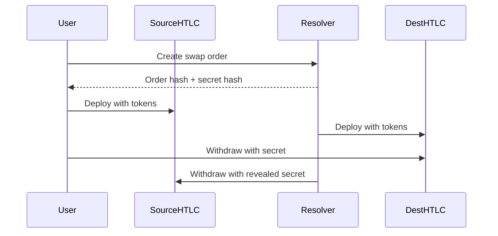

# Swap.Garden Monorepo

A monorepo containing all components of the Swap.Garden protocol with HTLC-based cross-chain swaps.

## 📁 Project Structure

```
swap.garden/
├── packages/
│   ├── frontend/          # Next.js frontend application
│   ├── contracts/         # Legacy Solidity smart contracts
│   ├── evm/              # HTLC contracts for cross-chain swaps
│   ├── relayer/          # Transaction relayer service
│   ├── resolver/         # HTLC resolver service
│   └── cli/              # Command-line interface for swaps
├── package.json          # Root workspace configuration
└── README.md
```

## 🌉 Cross-Chain Swap Architecture

The system uses Hash Time Locked Contracts (HTLCs) to enable trustless cross-chain swaps:

1. **Source Chain**: User locks tokens in HTLC with a hash of a secret
2. **Destination Chain**: Resolver locks equivalent tokens with the same hash
3. **Atomic Swap**: User reveals secret to claim tokens on destination, resolver uses revealed secret to claim tokens on source

### Supported Networks
- **Polygon Amoy** (Testnet) - Chain ID: 80002
- **Ethereum Sepolia** (Testnet) - Chain ID: 11155111

## 🚀 Quick Start

### Prerequisites

- Node.js 18+ 
- Yarn package manager
- Git

### Installation

1. Clone the repository:
```bash
git clone <repository-url>
cd swap.garden
```

2. Install dependencies for all packages:
```bash
yarn install
```

### Development

Start all services in development mode:

```bash
# Frontend (Next.js)
yarn dev

# HTLC Resolver service
yarn dev:resolver

# Relayer service  
yarn dev:relayer

# Compile HTLC contracts
yarn compile:evm
```

## 📦 Packages

### Frontend (`packages/frontend`)
- **Framework**: Next.js 15 with React 19
- **Styling**: Tailwind CSS 4
- **TypeScript**: Full type safety
- **Port**: 3000 (default)

```bash
cd packages/frontend
yarn dev
```

### EVM (`packages/evm`)
- **Framework**: Hardhat
- **Contracts**: HTLC Factory, Source & Destination contracts
- **Networks**: Polygon Amoy, Ethereum Sepolia
- **Testing**: Comprehensive HTLC workflow tests

```bash
cd packages/evm
yarn compile
yarn test
yarn deploy:sepolia  # Deploy to Sepolia
yarn deploy:amoy     # Deploy to Polygon Amoy
```

### Resolver (`packages/resolver`)
- **Framework**: Express.js with TypeScript  
- **Purpose**: HTLC order management and cross-chain coordination
- **Port**: 3002 (default)

```bash
cd packages/resolver
yarn dev
```

### Relayer (`packages/relayer`)
- **Framework**: Express.js with TypeScript
- **Purpose**: Transaction relaying and meta-transactions
- **Port**: 3001 (default)

```bash
cd packages/relayer
yarn dev
```

### CLI (`packages/cli`)
- **Framework**: Commander.js with TypeScript
- **Purpose**: Command-line interface for cross-chain swaps
- **Features**: Interactive swap wizard, order management

```bash
cd packages/cli
yarn build
yarn swap  # Interactive swap wizard
```

### Legacy Contracts (`packages/contracts`)
- **Framework**: Hardhat
- **Purpose**: Legacy smart contracts (for reference)

```bash
cd packages/contracts
yarn compile
yarn test
yarn deploy
```

## 🛠 Available Scripts

From the root directory:

- `yarn dev` - Start frontend development server
- `yarn build` - Build all packages
- `yarn test` - Run tests across all packages
- `yarn lint` - Lint all packages
- `yarn compile:evm` - Compile HTLC contracts
- `yarn deploy:evm:sepolia` - Deploy HTLC contracts to Sepolia
- `yarn deploy:evm:amoy` - Deploy HTLC contracts to Polygon Amoy
- `yarn dev:resolver` - Start HTLC resolver service
- `yarn dev:relayer` - Start relayer service
- `yarn dev:cli` - Start CLI in development mode
- `yarn swap` - Run interactive swap wizard

## 🔧 Cross-Chain Swap Usage

### 1. Using the CLI (Recommended)

**Interactive Swap Wizard:**
```bash
yarn swap
```

**Manual Commands:**
```bash
# Get quote
swap-garden quote -f amoy -t sepolia -a 100 --from-token 0x... --to-token 0x...

# Create swap order
swap-garden create -f amoy -t sepolia -fa 100 -ta 99 --from-token 0x... --to-token 0x... -m 0x...

# Execute swap
swap-garden execute <orderHash> --signature <signature>

# Check status
swap-garden status <orderHash>

# Withdraw (with secret)
swap-garden withdraw <orderHash> <secret> --chain sepolia
```

### 2. Using the API

**Create Swap Order:**
```bash
curl -X POST http://localhost:3002/swap/create \
  -H "Content-Type: application/json" \
  -d '{
    "maker": "0x...",
    "srcChainId": 80002,
    "dstChainId": 11155111,
    "srcToken": "0x...",
    "dstToken": "0x...",
    "srcAmount": "100000000000000000000",
    "dstAmount": "99000000000000000000"
  }'
```

**Execute Swap:**
```bash
curl -X POST http://localhost:3002/swap/execute \
  -H "Content-Type: application/json" \
  -d '{
    "orderHash": "0x...",
    "makerSignature": "0x..."
  }'
```

## 📋 Environment Variables

Create `.env` files in each package directory using the `.env.example` templates:

### Core Configuration
- `packages/evm/.env` - Contract deployment and network settings
- `packages/resolver/.env` - HTLC resolver configuration
- `packages/cli/.env` - CLI default settings

### Network Configuration
```env
SEPOLIA_RPC_URL=https://rpc.sepolia.org
POLYGON_AMOY_RPC_URL=https://rpc-amoy.polygon.technology
PRIVATE_KEY=your_private_key_here
RESOLVER_PRIVATE_KEY=your_resolver_private_key_here
```

### Contract Addresses (populated after deployment)
```env
SEPOLIA_HTLC_FACTORY=0x...
POLYGON_AMOY_HTLC_FACTORY=0x...
```

## 🏗 Architecture

The monorepo follows a microservices architecture with HTLC-based cross-chain swaps:

1. **Frontend** - User interface for cross-chain swaps
2. **EVM Contracts** - HTLCs for trustless cross-chain swaps
3. **Resolver** - Coordinates cross-chain transactions and manages orders
4. **Relayer** - Handles transaction relaying and meta-transactions
5. **CLI** - Command-line interface for developers and power users

### HTLC Swap Flow



## 🧪 Testing

Run tests for all packages:
```bash
yarn test
```

Run tests for specific packages:
```bash
# HTLC contracts
cd packages/evm && yarn test

# Resolver
cd packages/resolver && yarn test

# CLI
cd packages/cli && yarn test
```

## 🚀 Deployment

### 1. Deploy HTLC Contracts

```bash
# Deploy to Sepolia
yarn deploy:evm:sepolia

# Deploy to Polygon Amoy  
yarn deploy:evm:amoy
```

### 2. Update Environment Variables

Copy the deployed contract addresses to your `.env` files.

### 3. Start Services

```bash
# Start resolver
yarn dev:resolver

# Start relayer (optional)
yarn dev:relayer
```

### 4. Test Cross-Chain Swap

```bash
# Use the interactive CLI
yarn swap
```

## 🤝 Contributing

1. Create a feature branch
2. Make your changes in the appropriate package
3. Run tests: `yarn test`
4. Run linting: `yarn lint`
5. Submit a pull request

## 📄 License

MIT License - see LICENSE file for details
